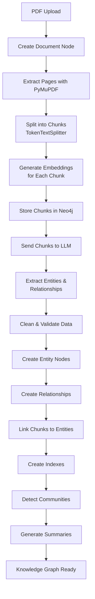

# LLM Graph Builder Pipeline: Comprehensive Analysis

## Executive Summary

The LLM Graph Builder is a sophisticated pipeline that transforms unstructured documents (PDFs, DOCs, TXT, YouTube videos, web pages) into structured knowledge graphs stored in Neo4j. It leverages Large Language Models (LLMs) through the LangChain framework to extract entities and relationships, creating a queryable graph database that enables advanced semantic search and question-answering capabilities.

## Architecture Overview

```
[Document Input] → [Chunking] → [Embedding] → [LLM Extraction] → [Graph Construction] → [Neo4j Storage] → [Post-Processing]
```

## Detailed Pipeline Stages

### Stage 1: Document Ingestion & Source Node Creation

#### Entry Points
- **API Endpoint**: `/extract` (backend/score.py:196)
- **Handler**: `extract_knowledge_graph_from_file()`

#### Process Flow
1. **File Upload**: Documents enter through multiple sources:
   - Local files via `/upload_large_file_into_chunks`
   - S3 buckets
   - Google Cloud Storage
   - Web URLs
   - YouTube videos
   - Wikipedia articles

2. **Source Node Creation**: A `Document` node is created in Neo4j with metadata:
   ```cypher
   MERGE (d:Document {fileName: $fn})
   SET d.fileSize = $fs,
       d.fileType = $ft,
       d.status = 'New',
       d.model = $model,
       d.createdAt = $timestamp
   ```

### Stage 2: Document Processing & Chunking

#### Key Components
- **Module**: `src/create_chunks.py`
- **Class**: `CreateChunksofDocument`
- **Loader**: `PyMuPDFLoader` for PDFs, `UnstructuredFileLoader` for other formats

#### PDF Processing Pipeline

1. **Document Loading** (`src/document_sources/local_file.py`):
   ```python
   def get_documents_from_file_by_path(file_path, file_name):
       if file_extension == '.pdf':
           loader = PyMuPDFLoader(file_path)
       else:
           loader = UnstructuredFileLoader(file_path, mode="elements")
       pages = loader.load()
   ```

2. **Text Extraction**:
   - PDFs are processed page by page
   - Metadata preserved: page numbers, source, file type
   - Character encoding detection for text files

3. **Chunking Strategy** (`split_file_into_chunks`):
   ```python
   text_splitter = TokenTextSplitter(
       chunk_size=token_chunk_size,  # Default: configurable
       chunk_overlap=chunk_overlap    # Default: 20 tokens
   )
   ```

   **Chunk Properties**:
   - Size limits: Maximum 10,000 tokens per chunk (configurable)
   - Overlap: Maintains context between chunks
   - Metadata: Position, length, content offset, page number

4. **Chunk Node Creation**:
   ```cypher
   MERGE (c:Chunk {id: $chunk_id})
   SET c.text = $content,
       c.position = $position,
       c.length = $length
   MERGE (c)-[:PART_OF]->(d:Document)
   ```

5. **Chunk Relationships**:
   - `FIRST_CHUNK`: Links document to first chunk
   - `NEXT_CHUNK`: Sequential chunk connections
   - Hash-based chunk IDs using SHA1 of content

### Stage 3: Embedding Generation

#### Components
- **Module**: `src/make_relationships.py`
- **Function**: `create_chunk_embeddings()`
- **Models**: Configurable (default: all-MiniLM-L6-v2, OpenAI, VertexAI)

#### Process
1. **Vector Generation**:
   ```python
   embeddings_arr = embeddings.embed_query(chunk.page_content)
   ```

2. **Storage in Neo4j**:
   ```cypher
   MATCH (c:Chunk {id: $chunkId})
   SET c.embedding = $embeddings
   ```

3. **Vector Index Creation**:
   ```cypher
   CREATE VECTOR INDEX vector IF NOT EXISTS
   FOR (c:Chunk) ON c.embedding
   OPTIONS {
       indexConfig: {
           'vector.dimensions': 384,
           'vector.similarity_function': 'cosine'
       }
   }
   ```

### Stage 4: LLM-Based Entity & Relationship Extraction

#### Core Module
- **File**: `src/llm.py`
- **Function**: `get_graph_from_llm()`

#### Supported LLMs
- OpenAI GPT (3.5, 4, o3-mini)
- Google Gemini
- Anthropic Claude
- Azure OpenAI
- Diffbot NLP
- Groq
- Amazon Bedrock
- Ollama (local)
- Custom OpenAI-compatible endpoints

#### Extraction Process

1. **Chunk Combination** (`get_combined_chunks`):
   - Combines multiple chunks for context
   - Default: Process chunks individually or in groups
   - Configurable via `chunks_to_combine` parameter

2. **LLM Transformer Setup**:
   ```python
   llm_transformer = LLMGraphTransformer(
       llm=llm,
       node_properties=["description"],
       relationship_properties=["description"],
       allowed_nodes=allowedNodes,
       allowed_relationships=allowedRelationship
   )
   ```

3. **Graph Document Generation**:
   - Sends chunk text to LLM with extraction prompt
   - LLM returns structured entities and relationships
   - Format: GraphDocument with nodes and relationships

4. **Schema Enforcement**:
   - **Allowed Nodes**: Comma-separated list (e.g., "Person,Organization,Location")
   - **Allowed Relationships**: Triplets (e.g., "Person,WORKS_FOR,Organization")
   - Schema validation before extraction

### Stage 5: Graph Construction in Neo4j

#### Key Functions
- `save_graphDocuments_in_neo4j()` - Persists extracted entities
- `merge_relationship_between_chunk_and_entites()` - Links chunks to entities

#### Entity Storage Process

1. **Data Cleaning** (`handle_backticks_nodes_relationship_id_type`):
   - Removes backticks from node/relationship types
   - Validates IDs and types
   - Ensures data consistency

2. **Node Creation**:
   ```cypher
   MERGE (n:EntityType {id: $node_id})
   SET n.description = $description
   ```

3. **Relationship Creation**:
   ```cypher
   MATCH (a:EntityType {id: $source_id})
   MATCH (b:EntityType {id: $target_id})
   MERGE (a)-[r:RELATIONSHIP_TYPE]->(b)
   SET r.description = $description
   ```

4. **Chunk-Entity Linking**:
   ```cypher
   MATCH (c:Chunk {id: $chunk_id})
   MATCH (n:EntityType {id: $node_id})
   MERGE (c)-[:HAS_ENTITY]->(n)
   ```

### Stage 6: Post-Processing & Enhancement

#### Components
- **Module**: `src/post_processing.py`
- **Community Detection**: `src/communities.py`

#### Post-Processing Steps

1. **Full-Text Index Creation**:
   ```cypher
   CREATE FULLTEXT INDEX entities
   FOR (n:Label1|Label2|...)
   ON EACH [n.id, n.description]
   ```

2. **Entity Deduplication**:
   - KNN similarity matching using embeddings
   - Configurable similarity threshold (default: 0.94)
   - Merges duplicate entities

3. **Community Detection** (GraphDataScience):
   ```python
   # Louvain algorithm for community detection
   gds.louvain.mutate(
       graph_name,
       mutateProperty='communities',
       includeIntermediateCommunities=True
   )
   ```

   **Community Hierarchy**:
   - Level 0: Direct entity communities
   - Level 1-N: Parent communities
   - Maximum 3 levels by default

4. **Community Summarization**:
   - LLM generates summaries for each community
   - Summaries stored as properties
   - Enables topic-based navigation

5. **Graph Schema Consolidation**:
   - Merges similar relationship types
   - Consolidates node labels
   - Cleans orphaned nodes

### Stage 7: Query & Retrieval

#### Chat Modes
1. **Vector Search**: Semantic similarity on chunk embeddings
2. **Graph Search**: Cypher queries on entities/relationships
3. **Hybrid Search**: Combines vector + graph traversal
4. **Full-Text Search**: Keyword matching on text content
5. **Community Search**: Topic-based retrieval

#### Retrieval Pipeline
1. Query embedding generation
2. Vector similarity search or graph traversal
3. Context aggregation from chunks
4. LLM response generation with sources

## Data Flow Example: PDF Processing



## Key Design Patterns

### 1. Batch Processing
- Chunks processed in configurable batches (default: 20)
- Parallel processing with async/await
- Progress tracking via Document node updates

### 2. Error Handling & Retry Logic
- Deadlock detection with automatic retry
- Configurable retry conditions:
  - `START_FROM_BEGINNING`
  - `START_FROM_LAST_PROCESSED_POSITION`
  - `DELETE_ENTITIES_AND_START_FROM_BEGINNING`

### 3. State Management
- Document status tracking: New → Processing → Completed/Failed
- Chunk processing position tracking
- Cancellation support during processing

### 4. Performance Optimization
- Lazy loading of embeddings
- Batch Neo4j operations with UNWIND
- Connection pooling
- GZip compression for API responses

## Database Schema

### Core Node Types
- **Document**: Source file metadata
- **Chunk**: Text segments with embeddings
- **Entity Nodes**: Dynamic types from extraction
- **__Community__**: Clustering groups

### Core Relationships
- `(:Chunk)-[:PART_OF]->(:Document)`
- `(:Chunk)-[:NEXT_CHUNK]->(:Chunk)`
- `(:Chunk)-[:HAS_ENTITY]->(:Entity)`
- `(:Entity)-[:EXTRACTED_RELATIONSHIP]->(:Entity)`
- `(:Entity)-[:IN_COMMUNITY]->(:__Community__)`
- `(:__Community__)-[:PARENT_COMMUNITY]->(:__Community__)`

## Configuration & Tuning

### Key Parameters
- `MAX_TOKEN_CHUNK_SIZE`: Maximum tokens per chunk (10000)
- `DUPLICATE_SCORE_VALUE`: Entity similarity threshold (0.97)
- `UPDATE_GRAPH_CHUNKS_PROCESSED`: Batch size for updates (20)
- `EMBEDDING_MODEL`: Choice of embedding model
- `VITE_CHAT_MODES`: Available retrieval modes

### Performance Considerations
1. **Chunk Size**: Balance between context and processing time
2. **Embedding Dimensions**: Trade-off between accuracy and storage
3. **Community Levels**: Depth of hierarchical clustering
4. **Batch Sizes**: Memory vs. throughput optimization

## Conclusion

The LLM Graph Builder pipeline represents a sophisticated approach to knowledge extraction, combining:
- Modern NLP techniques (embeddings, LLMs)
- Graph database capabilities (Neo4j)
- Scalable architecture (async processing, batching)
- Flexible configuration (multiple LLMs, customizable schemas)

This architecture enables organizations to transform unstructured documents into queryable knowledge graphs, facilitating advanced semantic search, relationship discovery, and intelligent question-answering systems.